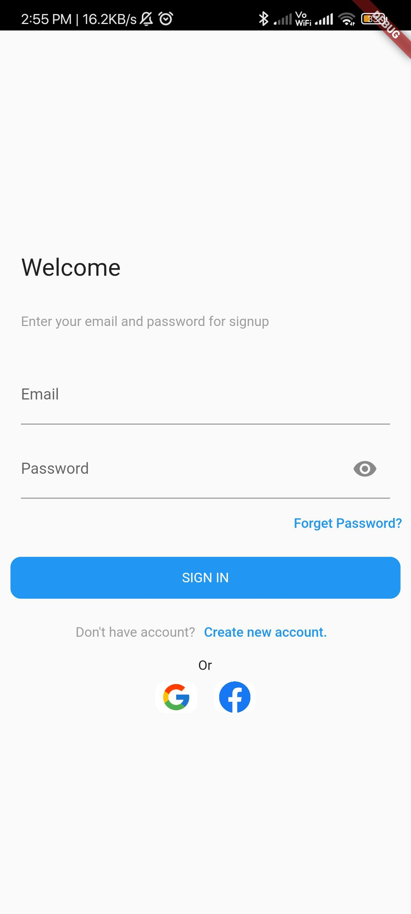
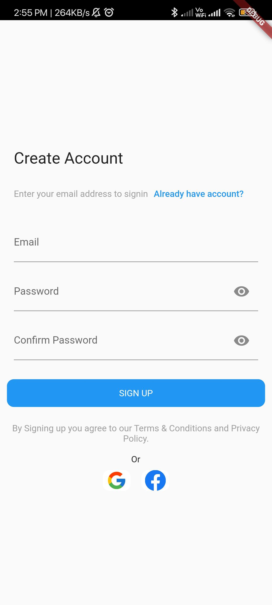
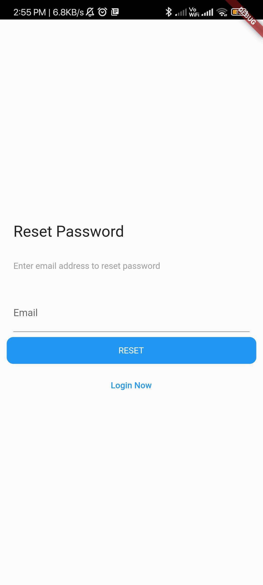

# Login Lite

- [Login Lite](#login-lite)
- [General Configuration](#general-configuration)
    - [Generate and Add `SHA` key to Firebase:](#generate-and-add-sha-key-to-firebase)
    - [Add **Firebase** to your **Flutter Application**](#add-firebase-to-your-flutter-application)
- [Open-source Libraries Used](#open-source-libraries-used)
  - [Flutter Official Plugins](#flutter-official-plugins)
  - [Third Party Plugins](#third-party-plugins)
- [Google Login](#google-login)
  - [Configuration for Google Login for Android](#configuration-for-google-login-for-android)
  - [Configuration for Google Login for IOS](#configuration-for-google-login-for-ios)
- [Facebook Login](#facebook-login)
  - [Configuration for Facebook Login on Android](#configuration-for-facebook-login-on-android)
  - [Configuration for Facebook Login on IOS](#configuration-for-facebook-login-on-ios)
- [Firebase-Email Login](#firebase-email-login)
  - [Configuration for Firebase-Email Login](#configuration-for-firebase-email-login)
- [Screenshots](#screenshots)
# General Configuration
### Generate and Add `SHA` key to Firebase:

For `Debug` mode:

```bash
keytool -list -v -keystore ~/.android/debug.keystore -alias androiddebugkey -storepass android -keypass android
```

For `Release` mode:

```bash
keytool -list -v -keystore {keystore_name} -alias {alias_name}
```
 ### Add **Firebase** to your **Flutter Application**
  [Adding Firebase](https://firebase.google.com/docs/flutter/)

# Open-source Libraries Used
## Flutter Official Plugins
- firebase_core: https://pub.dev/packages/firebase_core
- firebase_auth: https://pub.dev/packages/firebase_auth
- google_sign_in: https://pub.dev/packages/google_sign_in
- path: https://pub.dev/packages/path
- http: https://pub.dev/packages/http

## Third Party Plugins
- flutter_facebook_auth: https://pub.dev/packages/flutter_facebook_auth
- get_storage: https://pub.dev/packages/get_storage
- logger: https://pub.dev/packages/logger
- sms_autofill: https://pub.dev/packages/sms_autofill

# Google Login

## Configuration for Google Login for Android

- Add **Firebase** to your **Flutter Application**
  [Adding Firebase](https://firebase.google.com/docs/flutter/)

## Configuration for Google Login for IOS
- Make sure the file you downloaded file is named `GoogleService-Info.plist`.
- Move or copy `GoogleService-Info.plist` into the [my_project]/ios/Runner directory.
- Open `Xcode`, then right-click on Runner directory and select Add Files to `"Runner"`.
- Select `GoogleService-Info.plist` from the file manager.
- A dialog will show up and ask you to select the targets, select the Runner target.
- The above steps are not required if Firebase added throught Firbase CLI
- In `ios/Runner/Base.Iproj/Info.plist` add below with your google schemes.
```plist
<key>CFBundleURLTypes</key>
<array>
	<dict>
		<key>CFBundleTypeRole</key>
		<string>Editor</string>
		<key>CFBundleURLSchemes</key>
		<array>
			<string>[YOUR_GOOGLE_SCHEMA]</string>
		</array>
	</dict>
</array>
```

# Facebook Login

## Configuration for Facebook Login on Android

- Add **Firebase** to your **Flutter Application**
  [Adding Firebase](https://firebase.google.com/docs/flutter/)
- Register on [FacebookDev](https://developers.facebook.com/apps/create/)
- Add repository your_app -> gradle -> build.gradle (Project)

```dart
buildscript {
    repositories {
        mavenCentral()
    }
```

- Add repository your_app -> gradle -> build.gradle (Module)

```dart
dependencies {
	 implementation 'com.facebook.android:facebook-login:latest.release'
	}
```

- Open your `/app/src/main/res/values/strings.xml` file, if does not exsist create one.
- Add string elements with the names `facebook_app_id`, `fb_login_protocol_scheme` and` facebook_client_token`, and set the values to your `App ID` and `Client Token`.

```xml
<?xml version="1.0" encoding="utf-8"?>
<resources>
    <string name="app_name">[APP-NAME]</string>
    <string name="facebook_app_id">[APP-ID]</string>
    <string name="fb_login_protocol_scheme">fb[APP-ID]</string>
    <string name="facebook_client_token">[CLIENT-TOKEN]</string>
</resources>
```

- In `app -> src -> main -> AndroidManifest.xml` add the following under `application`

```xml
<application>
    <meta-data android:name="com.facebook.sdk.ApplicationId" android:value="@string/facebook_app_id"/>
    <meta-data android:name="com.facebook.sdk.ClientToken" android:value="@string/facebook_client_token"/>
    <activity android:name="com.facebook.FacebookActivity"
        android:configChanges=
                "keyboard|keyboardHidden|screenLayout|screenSize|orientation"
        android:label="@string/app_name" />
    <activity
        android:name="com.facebook.CustomTabActivity"
        android:exported="true">
        <intent-filter>
            <action android:name="android.intent.action.VIEW" />
            <category android:name="android.intent.category.DEFAULT" />
            <category android:name="android.intent.category.BROWSABLE" />
            <data android:scheme="@string/fb_login_protocol_scheme" />
        </intent-filter>
    </activity>
</application>
```

- In `app -> src -> main -> AndroidManifest.xml` add the following under `manifest`

```xml
</manifest>
    <uses-permission android:name="android.permission.INTERNET"/>
</manifest>
```

- In Facebook Dev console Add Platform as Android under Basic Settings
- Key Hash in console by running the following in the terminal and add the password as `android`

```bash
keytool -exportcert -alias androiddebugkey -keystore ~/.android/debug.keystore | openssl sha1 -binary | openssl base64
```

- Add `Package Names` and `Class Name` from app -> src -> main -> AndroidManifest.xml
- Add `App ID` and `App secret` into provider (`Facebok`) from Facebook developer console.

## Configuration for Facebook Login on IOS

```plist
<key>CFBundleURLTypes</key>
<array>
  <dict>
  <key>CFBundleURLSchemes</key>
  <array>
    <string>fb[APP-ID]</string>
  </array>
  </dict>
</array>
<key>FacebookAppID</key>
<string>[APP-ID]</string>
<key>FacebookClientToken</key>
<string>[CLIENT-TOKEN]</string>
<key>FacebookDisplayName</key>
<string>[APP-NAME]</string>
```
```plist
<key>LSApplicationQueriesSchemes</key>
<array>
  <string>fbapi</string>
  <string>fb-messenger-share-api</string>
</array>
```

# Firebase-Email Login

## Configuration for Firebase-Email Login

- Add **Firebase** to your **Flutter Application**
  [Adding Firebase](https://firebase.google.com/docs/flutter/)
# Screenshots


